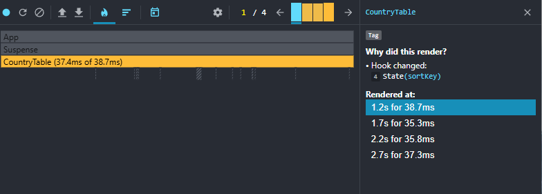
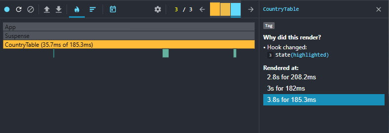
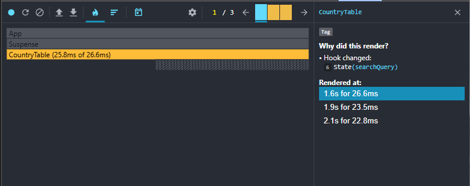
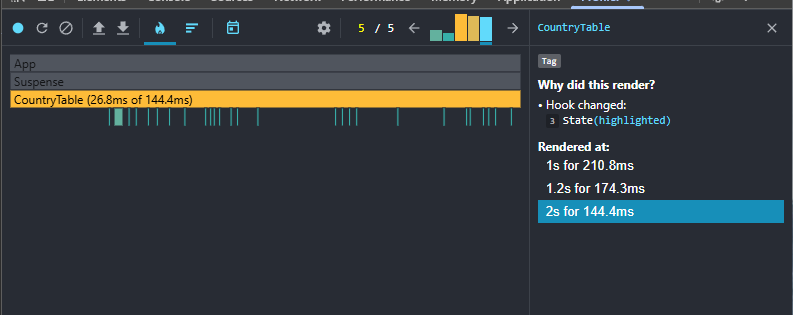

# OWID Viewer
A React application for exploring CO₂ emissions data from the Our World in Data dataset. Includes performance profiling and optimization experiments.

📦 Installation & Setup
Note: If you have trouble loading the file from the API, you can:

Place owid-co2-data.json in your project and change fetching in src/service/countryDataResource.ts:

```ts
const res = await fetch('../../owid-co2-data.json');
```

Or revert the last commit and put the file in the root directory.


# Performance information
Profiling
Initial profiling done with React Dev Tools Profiler.
Testing interactions:

- sorting by contry name and population
- selecting year
- search by contry name

## Before optimization

Loading application with click on sorting by population

First load(9.7 + 7.5 ms)  
  
Skeleton load (6.3ms)  
  
Country table load (121.4ms)  
  
Country table create root(121.6 ms)  
  
Automatic select last year(116.7ms)  
  
Sorting by population desc(133.6ms)  
  
Sorting by population asc(148.8ms)  
  
Country details expand(266.3ms)  
  
Year changing(takes 3 commits in profiler. (345.4, 65.8, 267.3ms))  
  
  
  
Search by name. Typed 3 letters. Takes 3 commits (56.7ms, 30.5ms, 26.2ms)  
  
  
  
Country details expand(112.4ms)  
  
Column menu open on yearly country details. (82.2ms)  
  
Column 'cumulative co2' added to table (109.5ms)    
  

## Optimization.

### useMemo + useCallback  
Add useMemo + useCallback to all of the operations(sorting, searching and year changing)  

Optimization results in unsignificant performance improvement. Sorting is better 1-2% or even worser. Year changing faster on 50%. Filtering optimisation unsignificant - around 1-5% better.  

Sort by population 4 clicks(137.9, 145.7, 156.6, 161.1 ms) 2 attempts  
  
  
Year change(144.7, 140.7, 26.8 ms) 2 attempts  
  
  
filter typing 'bel'(42.6, 26.2, 20.7 ms)  
  

### Implement React.Memo.  
Memo wrapper added on rendering country table rows. It should reduce time on rendering.  

Significant improving of performance of sorting(~200-300%) and filtering(first operation is better on 50%). A downgrading of yearchange performance - it seems highlighting takes more time then it was with useMemo only(about 10% on all operations and around 400% on last operation; was 30ms, become 160)  

Sorting by population 4 times(38.7, 35.3, 35.8, 37.3ms)  
  
Year change(208.2, 182, 185.3ms)  
  
Filter typing 'bel'(26.6, 23.5, 22.8ms)  
  

First load seems a little slower too.  
Start loading(table render and highlight)(210ms 174.3ms 144.4ms)  
  

Observations
- React.memo drastically improved sorting and filtering but hurt year-change performance. Highlighting during year change may be the bottleneck.  
- useMemo slightly improve all the interactions
